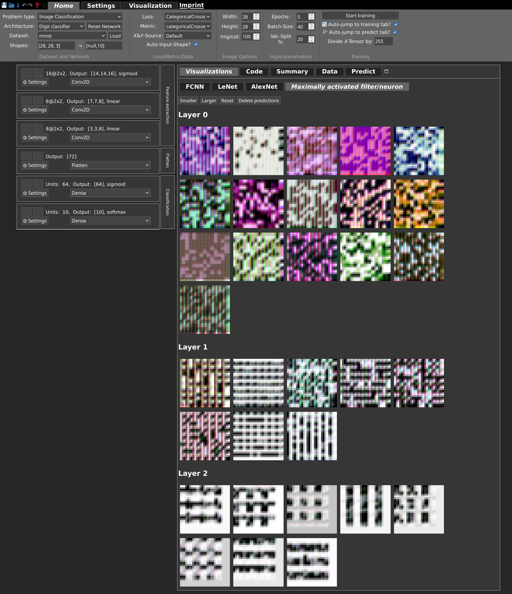

# TensorFlow.js Demonstrator

This is a more or less complete GUI for TensorFlow.js. With it, you can create and train models
fully in your browser.

# Status

This is a very early alpha.

# Screenshots





# Installation

## Apache2 + PHP + MongoDB + MySQL

A MySQL instance is only needed for the login functionality. MongoDB will be used for saving
models. Apache and PHP serve the JS-files. All calculations are done within the browser.

# Standing on the shoulders of giants

I use many different libraries to achieve this. This is a list of all the modules that I used
in creating this program:

[comment]: <> (BeginSources)

- [TensorFlow.js](https://www.tensorflow.org/js)

- [NN-SVG](http://alexlenail.me/NN-SVG/LeNet.html)

- [Prism](https://prismjs.com/)

- [Jquery-UI](https://jqueryui.com/)

- [d3.js](https://d3js.org/)

- [MathJax](https://www.mathjax.org/)

- [Convolution arithmetic](https://github.com/vdumoulin/conv_arithmetic)

- [Kaggle Cats and Dogs Dataset](https://www.microsoft.com/en-us/download/details.aspx?id=54765)

- [TensorFlow.js Examples](https://github.com/tensorflow/tfjs-examples/tree/master/visualize-convnet)

- [MNIST](http://yann.lecun.com/exdb/mnist/)

- [ChardinJS](https://heelhook.github.io/chardin.js/sequential.html)

- [Minify](https://github.com/matthiasmullie/minify.git)

[comment]: <> (EndSources)

# PHP Settings

In php.ini, set

```
upload_max_filesize = 1000M;
post_max_size = 1000M;
```
